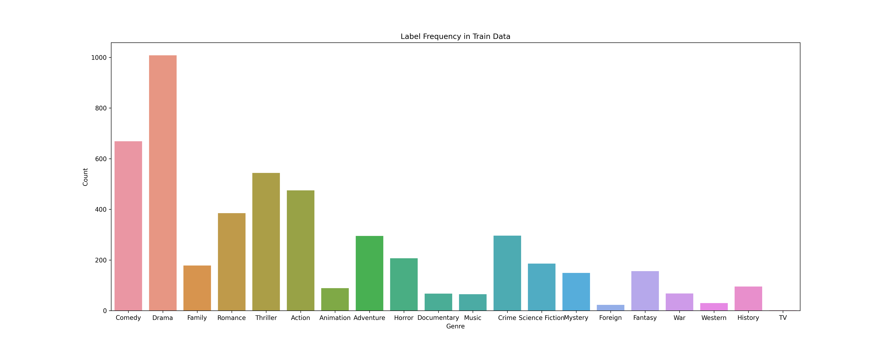
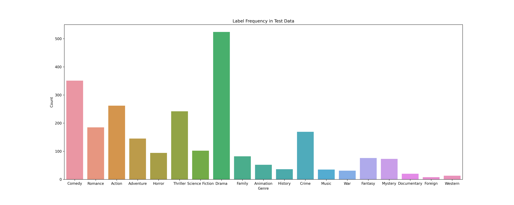
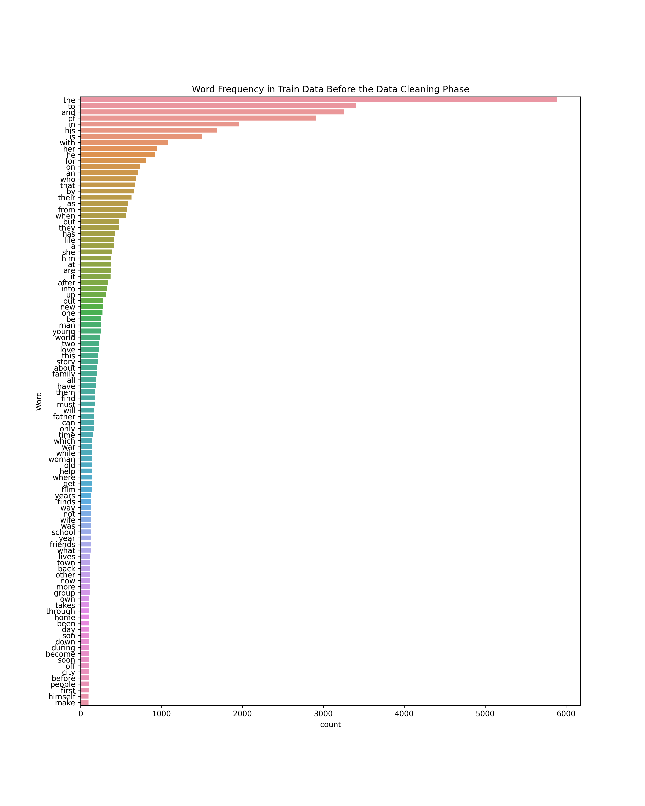
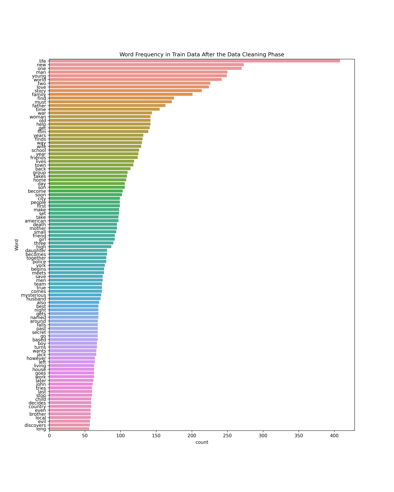

# Movie-Genre-Prediction

## Description
This project was part of assigments during the "Computational Intelligence" course and it focused on natural language processing using machine learning models. The given dataset is consisted of movies' overview and their genres and the task is to process the overview textes and predict the movie genres using a **combination of two TF-IDF and Word2Vec algorithms**. Each film can have multiple genre and below you can see the distribution of genres in the both train and test dataset.

## Implementation
Similar to other machine learning problems, the task is devided into some sub-tasks of preparing data and training machine learning models, which are described below.

### Pre-processing
Dataset was given in the form of excel files, so loading data is nothing but importing excell files. Later, as basic pre-processing steps, punctuations, numbers, single charactars, and multiple space are removed from the text. The result of these steps is illustrated below which shows the importance of them in keeping more important words and removing meaningless words.

You can see below the frequency of words in tranining data before the pre-processing steps and after it.

### Obtaining Word Representation
In order to process text we need to first transform it to the language of computers, i.e. digital numbers, so it is needed to derive some numerical vector representations of text to work with them instead. In order to do this, two well-known algorithms [Word2Vec](https://arxiv.org/pdf/1301.3781.pdf%C3%AC%E2%80%94%20%C3%AC%E2%80%9E%C5%93) and [TF-IDF](https://towardsdatascience.com/tf-idf-in-a-nutshell-b0ff082fbbc) had been introduced. However, these algorithms have thier own pros and cons, and so in this project, after implementing both of them, an initiative method is used to combine these two methods as to alleviate their problems.

#### Word2Vec
This method, as mentioned, helps us to derive word embeddings from our text, and preserving relationships between words is one of its most interesting features. Generally speaking, it learns words based on their context, and so it is of paramount importance that the model has learned representations from a similar corpus, otherwise it would not help much to derive the final text representation. In this project, due to the insufficient amount of data, I use a pre-trained model which is trained on [Google News](https://s3.amazonaws.com/dl4j-distribution/GoogleNews-vectors-negative300.bin.gz). After loading this model, all words of each description are fed into the model and then averaged resulting in a 300 elements vector which is the representation of a whole description.

#### TF-IDF
Similar to Word2Vec, this method is another way of obtaining numerical representation for the text. However, in contrast to Word2Vec, it does that irrespective of the meaning and context of the words. More precisely, it works based on two metrics: Term Frequency (TF) and Inverse Document Frequency (IDF). While the former determines the number of times a word appears in a document, the latter measures the inverse of the frequency of documents in which a word appears across the total number of documents. TF-IDF multiples these two metrics and derives a number per each word. Concatenating these numbers of a document's words yields that document's final represenation.

#### Combination
Considering the TF-IDF method, it does not take into account the meaning of words, while Word2Vec could do. Therefore, in this part of the project, these two methods are put together. The goal is to make TF-IDF aware of synonym words, and so, count synonyms together, e.g. not count two words like "good" and "well" separately. To do so, the concept of **bag of word** should be replaced by **bag of concept**. Therefore, before the TF-IDF starts counting, word clustering is performed by Word2Vec, and words in the same clusters are replaced by a representative word of that cluster (can be its mean). For example, all words like "good", "well", and "fine" are replaced by "nice" word ( which is actually very nice :) ) and counted 3 times by TF-IDF.

### Classifiers
The next step of the project involves employing a classifier that takes the numerical vector representations of documents and reports its genres.

## Conclusion

